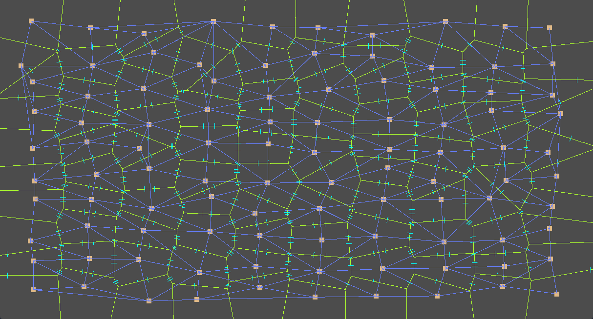

# GDScript Delaunay + Voronoi
A [Bowyer-Watson](https://en.wikipedia.org/wiki/Bowyer–Watson_algorithm) algorithm implementation for [Delaunay triangulation](https://en.wikipedia.org/wiki/Delaunay_triangulation) for [Godot](https://godotengine.org).

Also generates [Voronoi](https://en.wikipedia.org/wiki/Voronoi_diagram) diagram from triangulation, including neighbour cells scanning.

Written as a single GDScript file.




## How it works
Algorithm returns list of triangles for given set of points.

To calculate it, Bowyer-Watson algorithm originally generates super-triangle that contains all points.
Unfortunately, it wasn't giving good results on marginal points, so I've decided to implement "super-rectangle".
It means that you need to specify a rectangle that will contain all points.
If you won't specify such a rectangle, it will be calculated automatically

After that you can generate the list of triangles. That will also contain **border triangles** - triangles that share rectange corners.
Those triangles improve the Voronoi diagram generation but for the Delaunay triangulation you will most likely not want them. You can remove them with `remove_border_triangles()` or manually check `is_border_triangle()` while processing them in a loop.

Something similar happens after making Voronoi cells from triangles. Sites on rectangle edges tend to be quite stretched out and that's because there were no points behind to calculate it properly. You can remove such sites using `remove_border_sites()` function or manually check `is_border_site()` while processing them in a loop. In the future I plan to automatically clip such sites to rectangle boundary.


## Example

Check [example.tscn](example.tscn) which is a 2d scene with embedded with a full example script.

```GDScript
var delaunay = Delaunay.new(Rect2(0,0,1200,700))
#var delaunay = Delaunay.new() # use this to calculate rect automatically
for i in range(10):
  for j in range(10):
    delaunay.add_point(Vector2(50 + i*100 + rand_range(-15,15), 50 + j * 50 + rand_range(-15,15)))
    
var triangles = delaunay.triangulate()
for triangle in triangles:
  if !delaunay.is_border_triangle(triangle): # do not render border triangles
    show_triangle(triangle)
    
var sites = delaunay.make_voronoi(triangles)
for site in sites:
  if !delaunay.is_border_site(site): # do not render border sites
    show_site(site)
    if site.neighbours.size() == site.source_triangles.size(): # sites on edges will have incomplete neighbours information
      for neighbour_edge in site.neighbours:
        show_neighbour(neighbour_edge)
```


## Data structs / API

Check [source code](addons/gdDelaunay/Delaunay.gd) for more details

```GDScript
class_name Delaunay

# ==== CLASSES ====
class Edge: # Delaunay.Edge
	var a: Vector2
	var b: Vector2
	func equals(edge: Edge) -> bool
	func length() -> float
	func center() -> Vector2

class Triangle: # Delaunay.Triangle
	var a: Vector2
	var b: Vector2
	var c: Vector2
	var edge_ab: Edge
	var edge_bc: Edge
	var edge_ca: Edge
	var center: Vector2
	var radius_sqr: float
	func recalculate_circumcircle() -> void
	func is_point_inside_circumcircle(point: Vector2) -> bool
	func is_corner(point: Vector2) -> bool
	func get_corner_opposite_edge(corner: Vector2) -> Edge

class VoronoiSite: # Delaunay.VoronoiSite
	var center: Vector2
	var polygon: PoolVector2Array # clockwise points in absolute position
	var source_triangles: Array # of Triangle's that create this site internally, also clockwise
	var neighbours: Array # of VoronoiEdge, also clockwise
	func get_relative_polygon() -> PoolVector2Array # clockwise points in relative position to center
	func get_boundary() -> Rect2:

class VoronoiEdge: # Delaunay.VoronoiEdge
	var a: Vector2
	var b: Vector2
	var this: VoronoiSite
	var other: VoronoiSite
	func equals(edge: Edge) -> bool
	func length() -> float
	func center() -> Vector2
	func normal() -> Vector2
  
  
# ==== PUBLIC STATIC FUNCTIONS ====
static func calculate_rect(points: PoolVector2Array, padding: float = 0.0)) -> Rect2:
 
# ==== PUBLIC VARIABLES ====
var points: PoolVector2Array

# ==== CONSTRUCTOR ====
func _init(rect: Rect2 = Rect2()) -> Delaunay # do not specify rectangle to calculate it automatically

# ==== PUBLIC FUNCTIONS ====
func add_point(point: Vector2) -> void
func set_rectangle(rect: Rect2) -> void:

func is_border_triangle(triangle: Triangle) -> bool
func remove_border_triangles(triangulation: Array) -> void

func is_border_site(site: VoronoiSite) -> bool:
func remove_border_sites(sites: Array) -> void

func triangulate() -> Array # of Triangle
func make_voronoi(triangulation: Array) -> Array # of VoronoiSite
```


## To Do

- [ ] Implement [Lloyd's relaxation algorithm](https://en.wikipedia.org/wiki/Lloyd%27s_algorithm)
- [ ] Automatically clip border Voronoi cell polygons to rectangle border edges
- [ ] Port to Godot 4
